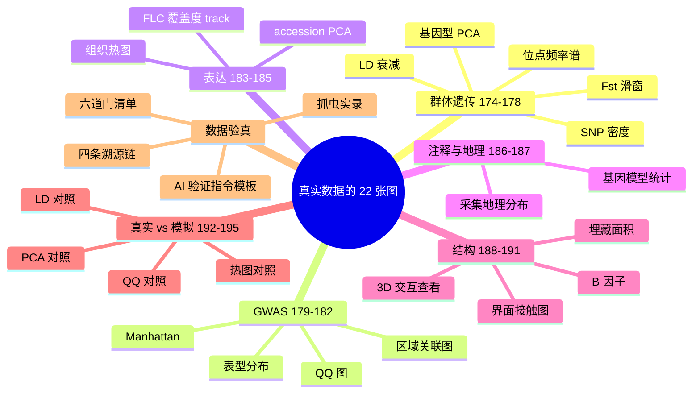

本系列已出七篇：[第一篇（41 张，统计与转录组临床）](/2026/09/12/2026-09-12-01-生信图表大全第一篇-41张图的坐标轴参数与绘制语言/) · [第二篇（33 张，群体遗传与基因组）](/2026/09/12/2026-09-12-02-生信图表大全第二篇-群体遗传比较基因组与单细胞的33张图/) · [第三篇（29 张，测序、表观与空间组学）](/2026/09/12/2026-09-12-03-生信图表大全第三篇-从测序QC到空间组学的29张图/) · [第四篇（30 张，蛋白、生态与 AI 多组学）](/2026/09/12/2026-09-12-04-生信图表大全第四篇-从蛋白互作到AI多组学的30张图/) · [第五篇（40 张，蛋白结构、变异与表达验证）](/2026/09/12/2026-09-12-05-生信图表大全第五篇-蛋白结构变异与表达验证的40张图/) · 第六篇（22 张，真实公开数据实战）即本篇 · [第七篇（190 张图 Nature 风格重构与方法选型）](/2026/09/13/2026-09-13-01-生信图表大全第七篇-把190张图重画成Nature风格/)。

前五篇合计 **173 张图**，全部是模拟数据——固定种子、可控形状，适合把图型本身讲清楚。但有读者一针见血：**模拟图学会的是"怎么画"，不是"画出来的东西可不可信"**。所以本篇把 22 张图（编号 174-195）换成真实公开数据：拟南芥 1001 Genomes 基因型矩阵（1135 份、1070 万 SNP）、AraPheno 表型数据库、27genomes 项目的 RNA-seq bigWig 与共识注释、PDB 晶体结构 4LSX——唯一例外是第七章的对照图，它们右半边/虚线一侧是模拟数据，为了把"真实"和"模拟"放到同一张画布上。计划中的甲基化图被第八章的验真门整章拦截（官方 release 的 bigWig 是空壳），第五章如实记录了这次改道。每张图右下角的水印从 "Simulated data" 换成了数据来源标注，图注里的每一个数字都与生成它的数据严格一致——这次连"数据本身长什么样"、"凭什么说这些数据真实有效"（第八章的完整验真证据链）一起讲。

## 一、先说数据：从哪来、多大、怎么进脚本

本篇所有真实数据的"采购清单"：

| 数据 | 来源 | 体量 | 进入方式 |
| --- | --- | --- | --- |
| 基因型矩阵 | 1001 Genomes [GMI-MPI v3.1](https://1001genomes.org/data/GMI-MPI/releases/v3.1/SNP_matrix_imputed_hdf5/) | 压缩包 317 MB（内含 HDF5，1070 万 SNP × 1135 份） | 下载解包，h5py 分块读取 |
| 表型（4 天根长，GT292） | [AraPheno](https://arapheno.1001genomes.org/) REST | 127 份 × 1 性状（<100 KB） | REST 拉取 CSV |
| RNA-seq 覆盖度 | 1001 Genomes [27genomes](https://1001genomes.org/data/1001Gp/27genomes/releases/current/rnaseq/) release | 240 个 bigWig（**不下载**） | pyBigWig 远程范围查询 |
| ~~甲基化（CG/CHG/CHH）~~ | 同上 [methylation](https://1001genomes.org/data/1001Gp/27genomes/releases/current/methylation/) 目录 | **验真拦截**：抽验 4 个文件 nBasesCovered=0，全部为空壳 | 弃用，改图，见第八章案例 ⑤ |
| 基因注释 | 各 accession 假基因组 GFF + [Ensembl Plants TAIR10 GFF3](https://ftp.ensemblgenomes.org/pub/plants/release-57/gff3/arabidopsis_thaliana/) | 26 × 2.6 MB + 9.5 MB | 下载解析 |
| 蛋白结构 | PDB [4LSX](https://www.rcsb.org/structure/4LSX)（BRI1–SERK1 共受体复合物） | 2.35 MB | 下载解析（[本站镜像](/lib/pdb/4LSX.pdb)） |

三个工程决定值得单独说：

**第一，下载预算控制在 500 MB 以内，靠"远程查询"而不是"下载再说"。** 基因型矩阵没法回避，只能整包下载（317 MB）；但 RNA-seq 的 bigWig 是随机访问格式——pyBigWig 打开 URL 后只按需取字节区间，查一个基因的覆盖度只拉几 KB。60 个文件的查询任务，网络流量不到 10 MB。生信云计算的入门课就藏在这：**格式决定了数据搬运的下限**。

**第二，坐标系要对齐。** 本篇同时碰了三套坐标系：SNP 矩阵和 Ensembl GFF3 用 TAIR10 参考坐标；27genomes 的 RNA-seq bigWig 用各 accession 自己的假基因组坐标（染色体名长这样：`10002_Chr1`），查询表达就必须用该 accession 自己的注释 GFF；而把三者连起来的 accession 编号（如 10002 = TueWal-2）在 1001 Genomes、AraPheno、bigWig 文件名里是同一套 id。画真实数据图，一半的时间花在把这三件事对齐上。

**第三，真实数据自带"脏"，脏得有教育意义。** 我们想收录的 DDM1（AT4G07300）在 27genomes 共识注释里根本不存在；著名开花基因 AP1 的覆盖度几乎全落在 R 链文件里——只查 F 链会得出"不表达"的假象。这些坑模拟数据永远教不了，正文遇到时会一一指出来。



### 速查表：本篇 22 张图

| 编号 | 图型 | 回答的问题 | 数据 |
| --- | --- | --- | --- |
| 174 | 基因型 PCA | 1135 份拟南芥按地理来源怎么分堆 | 1001G SNP 矩阵 |
| 175 | LD 衰减 | 连锁不平衡随距离掉多快 | 同上 |
| 176 | Fst 滑窗 | 两个地理组的分化岛在哪 | 同上 |
| 177 | 位点频率谱 | 稀有变异多到什么程度 | 同上 |
| 178 | SNP 密度 | 变异在 5 条染色体上怎么铺 | 同上 |
| 179 | 表型 vs 纬度散点 | 根长有没有纬度渐变 | AraPheno GT292 |
| 180 | Manhattan 图 | 根长关联信号在哪 | SNP 矩阵 + 表型 |
| 181 | QQ 图 | 关联 p 值整体偏不偏 | 同上 |
| 182 | 区域关联图 | 顶尖 SNP 附近长什么样 | 同上 + TAIR10 GFF3 |
| 183 | 表达热图 | 14 基因 × 4 组织的真实表达 | 27genomes bigWig |
| 184 | accession PCA | 群体间表达差异能否分堆 | 同上 |
| 185 | 覆盖度 track | FLC 座位 4 组织覆盖度对比 | 同上 |
| 186 | 基因模型统计 | 共识注释的 29807 个基因长啥样 | 27genomes GFF |
| 187 | 采集地理散点 | 1135 份从哪来 | acc.json |
| 188 | 3D 交互查看 | BRI1–SERK1-BL 复合物长什么样 | PDB 4LSX |
| 189 | 界面接触图 | 受体-共受体界面在哪 | 同上 |
| 190 | B 因子曲线 | 晶体里哪里最"软" | 同上 |
| 191 | 埋藏面积条形图 | 界面残基谁的贡献最大 | 同上 |
| 192 | PCA 对照 | 真实群体结构与模拟有何不同 | 真实 + 模拟 |
| 193 | 热图对照 | 真实表达矩阵"脏"在哪 | 真实 + 模拟 |
| 194 | LD 衰减对照 | 真实 LD 与模拟曲线形状差异 | 真实 + 模拟 |
| 195 | QQ 对照 | 真实 GWAS 的尾部为何翘起 | 真实 + 模拟 |

## 二、真实群体遗传：1135 份拟南芥长什么样（174-178）



```python
import numpy as np, h5py

f = h5py.File("imputed_snps_binary.hdf5", "r")
positions = f["positions"][:]                 # 10,709,949 个 SNP 的 TAIR10 坐标
regions   = f["positions"].attrs["chr_regions"]  # 每条染色体的行号区间
accs      = np.array([int(a) for a in f["accessions"][:]])  # 1135 个 accession id

def af_scan(f):
    """全基因组 alt 频率，500k 行一块地扫，只碰盘一遍"""
    snps = f["snps"]; af = np.empty(snps.shape[0], dtype=np.float32)
    for s in range(0, snps.shape[0], 500000):
        e = min(s + 500000, snps.shape[0])
        af[s:e] = snps[s:e, :].mean(axis=1)
    return af

def fetch_rows(f, idx):
    """按严格升序行号取基因型（保证行序与 idx 对齐）"""
    snps = f["snps"]; out = np.empty((len(idx), snps.shape[1]), dtype=np.float32)
    for s in range(0, len(idx), 200000):
        e = min(s + 200000, len(idx))
        out[s:e, :] = snps[idx[s:e], :]
    return out
```



**数据**：真实 —— 1001 Genomes GMI-MPI v3.1 imputed SNP matrix（[下载](https://1001genomes.org/data/GMI-MPI/releases/v3.1/SNP_matrix_imputed_hdf5/)），MAF 5-95% 过滤后抽样 80000 个 SNP；水印「Real data: 1001 Genomes GMI-MPI v3.1 SNP matrix」。

### 图 174 基因型 PCA：地理就是结构


**它回答什么问题**：这 1135 份拟南芥在基因型空间里怎么分布？课本答案——按地理来源分堆。真实数据的答案更立体：**美国采集组（US，绿）整体甩在主群左侧远处**（北美的引种重建群体），欧洲是一大团连续体，瑞典组（蓝）向右下拖出一条尾巴，意大利（紫）分成两瓣。有方向、有尾巴、有离群，但主群内部没有清晰真空隙——**连续渐变为主、局部离群为辅**，这才是真实群体结构的样子（图 192 会和模拟的三团对比）。

**怎么读**：横纵轴是 PC1/PC2（分别解释 8.5% 和 3.4% 的方差），灰点是样本量不足 50 的国家，彩点是六个大组。**别找"聚类中心"，看连续性与尾巴**——拟南芥自交繁殖，每份就是一个纯系，结构是地理与历史共同作用的平滑函数，不像模拟数据那样一坨一坨。

**用什么画**：GRM（亲缘关系矩阵）特征分解。1070 万 SNP 全上没必要也不现实：MAF 过滤后随机抽 80000 个，分块累积 GRM = XᵀX/n，再 `numpy.linalg.eigh`。抽样 8 万个时 PC1/PC2 的形状与全量已经肉眼不可分。

**图注示例**：

> 图 174 基因型 PCA（真实数据，1001 Genomes v3.1，1135 份 × 80000 SNP，MAF 5-95%）。PC1 解释 8.5%、PC2 解释 3.4% 方差；德国（GER，n=118）、西班牙（Spain，n=180）等大组按国家着色，其余灰色。



```python
import matplotlib.pyplot as plt

idx = pick_maf_snps(af, 0.05, 0.95, target=80000)   # 固定种子抽样
n = len(accs)
grm = np.zeros((n, n))
for s in range(0, len(idx), 100000):                # 分块累积，内存峰值 <1 GB
    blk = fetch_rows(f, idx[s:s+100000])
    blk -= blk.mean(axis=1, keepdims=True)
    grm += blk.T @ blk
grm /= len(idx)
w, V = np.linalg.eigh(grm)
P = V[:, ::-1][:, :2] * np.sqrt(w[::-1][:2])        # 主成分得分

fig, ax = plt.subplots(figsize=(7.2, 5.6))
rest = ~np.isin(countries, top6)
ax.scatter(P[rest,0], P[rest,1], s=8, color="#c7c7c7", alpha=.6)
for c, col in zip(top6, CCOL):
    m = countries == c
    ax.scatter(P[m,0], P[m,1], s=14, color=col, label=f"{c} n={m.sum()}")
var = w[::-1][:2] / w.sum() * 100
ax.set_xlabel(f"PC1 ({var[0]:.1f}%)"); ax.set_ylabel(f"PC2 ({var[1]:.1f}%)")
ax.legend(fontsize=8)
```



**数据**：真实 —— 同图 174。

### 图 175 LD 衰减：连锁不平衡掉得多快


**它回答什么问题**：两个 SNP 因为连锁而相关（r²），这个相关随距离衰减多快？这决定了 GWAS 信号的"影响范围"：LD 衰减越快，关联信号越靠近因果位点。

**怎么读**：横轴是 Chr1 上 SNP 对的距离（对数轴），纵轴 r²。红点是距离分箱均值，蓝雾是全部 SNP 对。**看红点**：最近距离箱（100-200 bp）平均 r² = 0.509，10-20 kb 箱已跌到 0.098。衰减到 r²≈0.1 大约在 10 kb——拟南芥自交导致 LD 比玉米、水稻长得多，这是自交物种 GWAS 定位分辨率差的根本原因。

**用什么画**：取 Chr1 前 5 Mb 的 MAF 过滤 SNP，均匀抽 2500 个；标准化后一个矩阵乘法 R = XₛXₛᵀ/n 得到全部两两相关，按距离分 8 个对数箱取均值。2500² 相关系数矩阵一秒算完，不需要任何近似。

**图注示例**：

> 图 175 LD 衰减（真实数据，Chr1 前 5 Mb，2500 SNP × 1135 份）。最近距离箱（100-200 bp）平均 r² = 0.509，10-20 kb 箱 r² = 0.098；蓝雾为全部 SNP 对，红点为分箱均值。



```python
c0s, c0e = regions[0]                       # Chr1 的行号区间
m = np.flatnonzero((positions >= c0s) & (positions < c0s + 5_000_000)
                   & (af >= .05) & (af <= .95))
sub = m[::max(1, len(m)//2500)][:2500]
X = fetch_rows(f, sub)
Xs = (X - X.mean(1, keepdims=True)) / X.std(1, keepdims=True)
R = Xs @ Xs.T / Xs.shape[1]                 # 2500 x 2500 相关矩阵

iu = np.triu_indices(len(sub), k=1)
d  = np.abs(positions[sub[iu[0]]].astype(int) - positions[sub[iu[1]]].astype(int))
r2 = R[iu]**2
edges = np.array([50, 100, 200, 500, 1000, 2000, 5000, 10000, 20000])
for a, b in zip(edges[:-1], edges[1:]):     # 对数分箱均值
    k = (d >= a) & (d < b)
    print(np.sqrt(a*b), r2[k].mean())
```



**数据**：真实 —— 同图 174。

### 图 176 Fst 滑窗：分化岛在哪


**它回答什么问题**：两个地理群体在基因组哪些区域分化最强？Fst 高的窗口（"分化岛"）往往藏着局部适应的痕迹——光照、土壤、病原压力不同的地方，等位基因频率被往不同方向推。

**怎么读**：横轴 Chr1 坐标（Mb），纵轴每个 100 kb 窗口的平均 Fst。黑虚线是全基因组均值 0.046，红点线是 95% 分位 0.089——冒过红线的就是候选分化岛。**单窗口高不叫岛，连片高才叫**；挑出最高的窗口后去 TAIR10 看里面有什么基因，是下一步（不属于本图的职责）。

**用什么画**：Nei 式 Fst：窗口内每个 SNP 算 Ht（合并群体杂合度）与 Hs（组内平均杂合度），Fst = (Ht−Hs)/Ht，窗口取均值；组 = 本数据里样本量最大的两个国家（Sweden n=243 vs Spain n=180）。

**图注示例**：

> 图 176 Fst 滑窗（真实数据，Chr1，100 kb 窗口，Sweden n=243 vs Spain n=180）。全基因组均值 0.046，95% 分位 0.089；最高窗口 Fst = 0.131，位于 4.25 Mb。



```python
countries = np.array([cm.get(int(a), "?") for a in accs])
g1, g2 = sorted(np.unique(countries[countries != "?"]),
                key=lambda c: -(countries == c).sum())[:2]
m1, m2 = countries == g1, countries == g2

for a, b in zip(edges[:-1], edges[1:]):          # 100 kb 窗口
    idx = np.flatnonzero((positions >= a) & (positions < b)
                         & (af >= .05) & (af <= .95))
    if len(idx) < 20: continue
    blk = f["snps"][np.sort(idx), :]
    p1, p2 = blk[:, m1].mean(1), blk[:, m2].mean(1)
    ht = 2 * (p1+p2)/2 * (1-(p1+p2)/2)           # 合并杂合度
    hs = (2*p1*(1-p1) + 2*p2*(1-p2)) / 2          # 组内平均
    ok = ht > 0
    fst_win = ((ht[ok]-hs[ok]) / ht[ok]).mean()
```



**数据**：真实 —— 同图 174。

### 图 177 位点频率谱：稀有变异的海洋


**它回答什么问题**：群体里大多数变异的频率有多低？折叠 SFS（minor allele frequency 分布）是群体历史的指纹：正选择、群体扩张都会在低频端堆出尖峰。

**怎么读**：横轴最小等位基因频率（0-0.1 截断展示），纵轴对数刻度的 SNP 数目。**第一根柱子的高度决定了整张图的形状**：3735072 个单例-双例级变异（占多态位点 34.9%）——真实群体就是稀有变异的海洋，中性理论的 1/f 期望线在它面前矮一截。

**用什么画**：MAF = min(af, 1−af)，对全部 1070 万 SNP 直接 1000 箱直方图 + 对数 y 轴。不需要抽样——这本来就是一个一维统计量。

**图注示例**：

> 图 177 折叠位点频率谱（真实数据，全部 10,709,949 个 SNP）。MAF < 0.1% 的变异 3735072 个，占多态位点的 34.9%；纵轴对数刻度。



```python
mac = np.minimum(af, 1 - af)          # af 是 af_scan 的输出
fig, ax = plt.subplots(figsize=(6.8, 4.6))
ax.hist(mac, bins=1000, range=(0, 0.5), color="#1f77b4")
ax.set_yscale("log"); ax.set_xlim(0, 0.1)
ax.set_xlabel("Minor allele frequency")
ax.set_ylabel("Number of SNPs (log)")
k = mac * len(accs)
singletons = int(((k >= .5) & (k < 1.5)).sum())
```



**数据**：真实 —— 同图 174。

### 图 178 SNP 密度：变异在染色体上怎么铺


**它回答什么问题**：1070 万个 SNP 在 5 条染色体上均匀吗？不均匀——着丝粒附近重组低、变异也低，基因区因为功能约束变异少于重复区。密度图是全基因组数据最诚实的"体检表"：测序和填充的坑都会在这里现形。

**怎么读**：五条横带 = 五条染色体，每 1 Mb 窗口填充一块，高度 = 每 kb 的 SNP 数（全基因组平均 89.2 SNPs/kb）。看两处：着丝粒附近的低谷、端部的骤升。**任何与生物学预期不符的条带都可能提示数据问题**——这正是把密度图放进流水线的原因。

**用什么画**：`numpy.histogram` 按染色体分别对 1 Mb 边界分箱，五条带垂直堆叠。纯坐标运算，1070 万个坐标一遍过。

**图注示例**：

> 图 178 SNP 密度（真实数据，1 Mb 窗口）。全基因组平均 89.2 SNPs/kb，最高窗口 187.1 SNPs/kb（3）；着丝粒附近可见低谷。



```python
fig, ax = plt.subplots(figsize=(8.2, 3.6))
for ci in range(5):
    s, e = regions[ci]
    w = np.arange(s, e + 1_000_000, 1_000_000)
    h, _ = np.histogram(positions[(positions >= s) & (positions < e)], bins=w)
    dens = h / 1000.0                               # SNPs per kb
    ax.fill_between(w[:-1]/1e6, ci*22, ci*22 + dens, step="post",
                    color=colors[ci], alpha=.75, lw=0)
    ax.text(w[0]/1e6, ci*22 + 8, f"Chr{ci+1}", fontsize=8)
ax.set_yticks([]); ax.set_xlabel("Position (Mb)")
ax.set_ylabel("SNPs per kb (window 1 Mb)")
```



## 三、真实 GWAS：把根长打回基因组（179-182）

**数据**：真实 —— 表型来自 AraPheno [GT292](https://arapheno.1001genomes.org/phenotype/292/)（4 天根长，127 份有值；126 份采集自瑞典，纬度 55.4-63.0°N，是一个纬度梯度实验），基因型同本章；与 1001G 矩阵的交集 **100 份**——27 份表型材料不在 v3.1 基因型矩阵里，这是真实数据拼接的日常，图注如实标注 n=100。

### 图 179 根长 vs 采集纬度：一个真实的渐变群


**它回答什么问题**：这批瑞典材料的长势随采集纬度怎么变？纬度渐变（cline）是局部适应最经典的信号——生长季长度、光周期、冬季低温都在纬度上排了队。先看表型本身的格局，再谈基因（GWAS 在后两张）。

**怎么读**：横轴采集纬度，纵轴 4 天根长，红线是线性拟合（0.086 cm/°，r = 0.151，n=100）。看两点：斜率的**方向**（适应学上的第一问题）和 r 的**绝对值**——真实表型的散点噪声远大于教科书示意，r 很少超过 0.4，这是正常的，不是画错了。

**用什么画**：`plt.scatter` 加 `numpy.polyfit` 一阶拟合。AraPheno 的表型行自带 accession 经纬度，一行 join 就能画——表型数据库的隐藏福利。

**图注示例**：

> 图 179 根长（4 天）vs 采集纬度（真实数据，AraPheno GT292，与基因型矩阵交集 n=100）。线性拟合斜率 0.086 cm/°，Pearson r = 0.151；全表型均值 5.92 ± 1.54 cm。



```python
import csv
acc2val, latmap = {}, {}
with open("pheno292.txt") as fp:
    for r in csv.DictReader(fp):
        acc2val[int(r["accession_id"])] = float(r["phenotype_value"])
        latmap[int(r["accession_id"])] = float(r["accession_latitude"])

cols = [j for j, a in enumerate(accs) if int(a) in acc2val]
y   = np.array([acc2val[int(accs[j])] for j in cols])
lat = np.array([latmap[int(accs[j])] for j in cols])

ax.scatter(lat, y, s=26, alpha=.75, edgecolor="k", lw=.4)
k, b = np.polyfit(lat, y, 1)
r = np.corrcoef(lat, y)[0, 1]
xs = np.array([lat.min(), lat.max()])
ax.plot(xs, k*xs + b, "--", color="#d62728",
        label=f"linear fit: {k:.2f} cm/deg, r = {r:.2f}")
```



**数据**：真实 —— 同图 179。

### 图 180 Manhattan 图：全基因组关联信号在哪里


**它回答什么问题**：1070 万个 SNP 里，哪些与根长显著相关？Manhattan 图把全部 p 值铺成天际线，最高的楼就是候选区域。

**怎么读**：横轴是拼接后的 5 条染色体（交替深浅蓝区分），纵轴 −log10(p)。红虚线是 Bonferroni 阈值 −log10(0.05/1795498) = 7.6。**本图最诚实的地方：最高的楼 −log10(p) = 6.8，没有过线**。两个原因都在真实数据里写得明明白白：n=100 对 180 万个检验，功效先天不足；群体结构带来的膨胀 λ = 1.62（下一张 QQ 图）把背景 p 值整体压低，阈值变得更难够到。真实 GWAS 常常如此——**全基因组显著不是唯一产出**，看楼群形状、比区域、用生物学验证，才是继续往下走的路。

**用什么画**：分块线性回归（SNP ~ 根长），每个 SNP 一个 t 检验；MAF < 5% 的位点直接置 p=1 不参与检验。20 万行一块，全基因组一遍过。

**图注示例**：

> 图 180 根长 GWAS Manhattan 图（真实数据，100 份 × 1795498 个过 MAF 过滤的 SNP）。Bonferroni 阈值 7.6（红虚线）；最高信号 −log10(p) = 6.8，未过线——功效不足与结构膨胀（λ=1.62）共同作用的结果。



```python
from scipy import stats as sstats

n = len(cols); yc = y - y.mean(); syy = yc @ yc
for s in range(0, snps.shape[0], 500000):
    e = min(s + 500000, snps.shape[0])
    X  = snps[s:e, cols].astype(np.float32)
    xc = X - X.mean(1, keepdims=True)
    sxx = (xc*xc).sum(1)
    b   = (xc @ yc) / np.maximum(sxx, 1e-9)
    t   = b * np.sqrt((n-2) * sxx / np.maximum(syy - sxx*b*b, 1e-9))
    p   = 2 * sstats.t.sf(np.abs(t), n-2)
    p   = np.where((X.mean(1) >= .05) & (X.mean(1) <= .95), p, 1.0)

M = int((p < 1).sum())                       # 有效检验数
bonf = -np.log10(0.05 / M)
# 五条染色体交替着色拼轴，红圈标最高点——代码同前几篇的 Manhattan 模板
```



**数据**：真实 —— 同图 179。

### 图 181 QQ 图：p 值整体诚实吗


**它回答什么问题**：Manhattan 的楼是"真信号"还是"系统性膨胀"（群体结构、隐性亲缘）？QQ 图把观测 p 与均匀期望排排队，**尾部翘多少，膨胀就有多少**。

**怎么读**：横轴期望 −log10(p)，纵轴观测。灰对角线是"完全随机"的完美答案。本图的基因组膨胀因子 λ = 1.621：这是**结构导致膨胀的典型量级**——100 份拟南芥横跨瑞典 55-63°N，纬度梯度就是结构本身（回看图 174 的分堆、图 179 的渐变）。**处理方式不是删信号，而是解释时保守**：线性混合模型（GEMMA/EMMAX）把亲缘矩阵吸收进零假设，是标准的下一步；本图用最朴素的线性回归，把"不校正会怎样"原样展示出来。

**用什么画**：排序 p 对期望分位散点；λ = median(χ²₁(observed)) / median(χ²₁)，一行代码。

**图注示例**：

> 图 181 根长 GWAS QQ 图（真实数据，1795498 个检验）。基因组膨胀因子 λ = 1.621；最尾端观测 −log10(p) = 6.8。



```python
pv = np.sort(p[p < 1]); n = len(pv)
exp_q = -np.log10(np.arange(1, n+1) / (n+1))
obs_q = -np.log10(pv)
lam = np.median(sstats.chi2.isf(pv, 1)) / sstats.chi2.isf(0.5, 1)

ax.scatter(exp_q, obs_q, s=5, color="#1f77b4", alpha=.6)
ax.plot([0, exp_q.max()*1.05]*2, "k--", lw=1)     # 对角参考线
```



**数据**：真实 —— 同图 179。

### 图 182 区域关联图：顶尖 SNP 的街区


**它回答什么问题**：把全基因组最高的关联信号放到显微镜下——±50 kb 里 SNPs 的 p 值梯度、它们与顶尖 SNP 的 LD（r²），以及 TAIR10 注释里这个区间有哪些基因。这是 LocusZoom 的最小复刻。

**怎么读**：上半部分每个点是一个 SNP，颜色越蓝表示与顶尖 SNP 的 r² 越高；红竖线是顶尖 SNP 自身。下半部分绿条是基因（AGI 编号）。**楼群形状 + LD 着色一起读**：如果高 LD 的邻居们 p 值也高，信号中心可信；如果最高点孤悬而低 LD 点散布，先怀疑填充错误。

**用什么画**：顶尖 SNP ±50 kb 的基因型矩阵与顶尖 SNP 向量逐列点积 → r²；基因轨道从 Ensembl TAIR10 GFF3 解析 `gene` 特征。LD 计算与图 175 同款，只是这次以单个 SNP 为锚。

**图注示例**：

> 图 182 顶尖 SNP 区域图（真实数据，Chr4:1951149 ±50 kb，颜色 = 与顶尖 SNP 的 r²）。区间内 TAIR10 基因 8 个。



```python
lo, hi = pos_top - 50_000, pos_top + 50_000
idx = np.flatnonzero((positions >= lo) & (positions < hi))
X = f["snps"][idx, :]                            # idx 已升序
j  = np.searchsorted(idx, pos_top)
xv = X[j].astype(np.float32); xv -= xv.mean()
Xc = X - X.mean(1, keepdims=True)
r2 = ((Xc @ xv) / np.sqrt((Xc*Xc).sum(1) * (xv @ xv)))**2
r2 = np.clip(r2, 0, 1)

for k in np.argsort(-r2):                        # 高 r² 画在上层
    ax.scatter((idx[k]/1e3), -np.log10(p[idx[k]]), s=14,
               color=plt.cm.Blues(0.15 + 0.85*r2[k]))
# 基因轨道：gzip 读 TAIR10 GFF3，取 type == "gene" 且与区间相交的行
```



## 四、真实表达：60 个 bigWig 的远程查询（183-185）

**数据**：真实 —— 1001 Genomes 27genomes release RNA-seq bigWig（[目录](https://1001genomes.org/data/1001Gp/27genomes/releases/current/rnaseq/)），**全部远程范围查询、未下载文件本体**；基因坐标用各 accession 自己的假基因组注释（`genes_v05_<acc>.gff.gz`），染色体名形如 `10002_Chr1`。

**本章的三个真实数据坑，先说在前头**：(1) bigWig 分 F/R 两个链向文件，著名开花基因 AP1 的信号几乎全在 R 链——只查 F 链会得到"不表达"的假阴性，本章一律 F+R 取均值；(2) 我们想收录的 DDM1（AT4G07300）在 27genomes 共识注释集中缺席，面板从 15 个基因变成 14 个；(3) 这批 bigWig 来自不同实验室的不同生长条件，**绝对 RPK 跨样本不可直接比较**，所以展示一律用行内 z-score，原始 RPK 进图注和 CSV。

### 图 183 组织表达热图：14 个基因 × 4 种组织


**它回答什么问题**：一组有名有姓的基因（生物钟 LHY/CCA1/TOC1、开花 FLC/FT/SOC1/AP1/LFY、胁迫 PR1/RD29A、光合 RBCS1A、表观 MET1、表观等位基因 FWA、以及 1 号染色体第一个基因 AT1G01010）在莲座叶、幼苗、花、花粉里的真实表达格局。

**怎么读**：行是基因（z-score 按行），列是组织（accession 10002 / TueWal-2）。看四个教学点：**花粉柱整体点亮**——CCA1 在花粉 250.6 RPK，是其他组织（0.3-1.3）的两百倍，FWA/MET1/LHY/FLC 也在花粉齐齐翻红；**PR1 在莲座叶 314723 RPK**（z=1.7）——病原胁迫的印记，这批材料的生长环境不干净；**RD29A 莲座叶 2038 / 幼苗 3092 RPK**——胁迫基因的高表达同样是条件的功劳而非组织特异；**FT 在莲座叶 92.3 RPK**，比多数教科书写的高。真实数据经常不按课本出牌，这才是它的价值。

**用什么画**：pyBigWig 对每个基因体 `stats(type="sum")`，换算 RPK（覆盖度和 / 基因长度 kb），行 z-score 后 `imshow`，格子标数值。

**图注示例**：

> 图 183 组织表达热图（真实数据，27genomes RNA-seq，acc. 10002，F+R 取均值）。格子数字为行 z-score；原始 RPK 例：PR1 莲座叶 314723、RD29A 莲座叶 2038、CCA1 花粉 250.6、RBCS1A 莲座叶 4136474。



```python
import pyBigWig

BASE = "https://1001genomes.org/data/1001Gp/27genomes/releases/current/rnaseq/"

def rpk_vector(acc, tissue, files):
    coords = gene_coords(acc)                    # 该 accession 自己的 GFF
    sums = []
    for fn in files:                             # F 与 R 都查，坏文件跳过
        bw = pyBigWig.open(BASE + fn); bw.chroms()
        row = [bw.stats(seqid, s, e, type="sum")[0] / kb
               for seqid, s, e, kb in gene_body(coords)]
        bw.close(); sums.append(row)
    return np.mean(sums, axis=0)                 # 文件均值 ≈ 总覆盖

# 10002 的四个组织各得一个 14 维向量，行 z-score 后 imshow：
#   cmap="RdYlBu_r", vmin=-2, vmax=2, 格心标 z 数值
```



**数据**：真实 —— 同图 183。

### 图 184 accession 表达 PCA：19 份在表达空间里分堆吗


**它回答什么问题**：基因型 PCA（图 174）分堆明显，表达 PCA 呢？答案是**堆形弱得多**——组织条件、生长批次的效应盖过了遗传结构。这张图是"表达数据的群体结构不好做"的诚实展示，也是很多论文里表达 PCA 其实分不出来的原因。

**怎么读**：每点一个 accession（Rosette，14 基因面板），颜色按采集国家。与图 174 对照：基因型里西班牙和德国分居两端，表达里它们犬牙交错——**31% + 18% 的方差里，生长条件贡献大于地理**。10002（TueWal-2）在 PC1 上甩到最左：它是面板里 PR1 表达最高的一份（314723 RPK，第二名 1741 的 1.6 倍）——病原应激把它的表达谱整体推离了群体。

**用什么画**：19 个 accession × 14 基因 RPK 矩阵 → 按基因 z-score → SVD 取前两主成分。远程查询部分与图 183 同款，F+R 两链文件并行 6 线程。

**图注示例**：

> 图 184 accession 表达 PCA（真实数据，Rosette，19 份 × 14 基因）。PC1 31%、PC2 18%；分堆弱于基因型 PCA（图 174），生长条件是主要方差来源。



```python
X = zrows(mat.T)                 # 25 x 14，行 z-score
Xc = X - X.mean(0, keepdims=True)
U, S, Vt = np.linalg.svd(Xc, full_matrices=False)
P = U[:, :2] * S[:2]
var = S**2 / np.sum(S**2) * 100
```



**数据**：真实 —— 同图 183。

### 图 185 FLC 座位覆盖度 track：春化开关在四种组织里的样子


**它回答什么问题**：FLC（AT5G10140，开花抑制主控）座位 ±3 kb 在四种组织下的 reads 覆盖度长什么样？track 图是浏览器（IGV/JBrowse）视角：不摘要成数字，直接看原始信号形状。

**怎么读**：四层填充曲线 = 四种组织，灰色区间是 FLC 基因体。看两处：**覆盖度峰是否落在基因体上**（Seedlings 8.3、Rosette 6.9 的峰都压在基因体及 3' 端，是真实转录的形状）；不同组织的峰高比——花粉全程不超过 0.5，先怀疑测序深度与组织特性，而不是急着下生物学结论。track 图逼你面对这种不确定性，热图不会。

**用什么画**：pyBigWig `intervals()` 拉取区间列表，50 bp 柱上取最大覆盖，`fill_between(step="post")` 四层堆叠。一个座位 4 个组织 8 个文件，流量几十 KB。

**图注示例**：

> 图 185 FLC（AT5G10140）±3 kb 覆盖度 track（真实数据，acc. 10002，四种组织，F/R 均值）。峰高：Seedlings 8.3、Rosette 6.9、Flowers 5.7、Pollen 0.5；灰色区间为基因体。



```python
seqid, s, e, _ = coords["AT5G10140"]
lo, hi = s - 3000, e + 3000
for t, col in zip(TISSUES, COLORS):
    bw = pyBigWig.open(BASE + files[t])
    iv = bw.intervals(seqid, lo, hi); bw.close()
    pos = np.arange(lo, hi, 50); cov = np.zeros(len(pos))
    for st, en, v in iv:
        cov[max(0,(st-lo)//50): max(1,(en-lo)//50)] = \
            np.maximum(cov[max(0,(st-lo)//50): max(1,(en-lo)//50)], v)
    ax.fill_between(pos, 0, cov, step="post", alpha=.55, color=col, label=t)
```



## 五、注释与地理：被验真改写的两图（186-187）

**这一章原本是"真实甲基化"**。计划里是 FWA 座位的单胞嘧啶剖面和 11 份甲基化组 × 表达的关联——然后验真门（第八章）把整个计划拦下了：27genomes release 的甲基化目录里，12 份 × 3 语境共 36 个 bigWig，抽验的 4 个头部 **nBasesCovered 全部为 0**——是没有任何数据的空壳文件。AI（和人）最容易犯的错就是硬着头皮画：空壳文件画出来是"全白图"，再配一段煞有介事的图注。**此处改用两套零网络的真数据补位，甲基化的故事原样搬进第八章当案例。**

**数据**：真实 —— genes_v05_10002.gff.gz（27genomes 共识注释）与 acc.json（AraPheno accession 元数据，经与 SNP 矩阵 id 求交得 1131 个有坐标的采集点）。

### 图 186 基因模型统计：29807 个共识基因长什么样


**它回答什么问题**：图 183-185 查表达用的注释文件，里面的基因模型本身长什么样？基因长度分布、每个基因的外显子数——这是所有下游分析（RPK 归一化、外显子-内含子分离）的地基。

**怎么读**：左图基因长度分布（中位 1.60 kb，长尾到 8 kb 开外）；右图外显子数（取每个基因最长转录本，中位 3）。**量级对表**（第八章第五道门）：TAIR10 已发表的中位基因长 ~1.7 kb、中位外显子 ~4，本图 1.60 kb / 3 与之同量级但略保守——共识注释合并了可变剪接，模型数比 TAIR10 少。**注意 0 外显子的基因消失在图外**（x 轴从 0 起，最左柱是单外显子基因）。

**用什么画**：gzip 流式解析 GFF3 的 gene/mRNA/exon 三种特征；exon 的 Parent 指向 mRNA，要经 mRNA 的 Parent 二跳映射回 gene，再取最长转录本——**解析注释文件的坑全在这三行**。

**图注示例**：

> 图 186 基因模型统计（真实数据，27genomes 共识注释 genes_v05_10002，29807 个基因）。基因长度中位 1.60 kb，外显子数（最长转录本）中位 3。



```python
import gzip

gene_len, mrna_gene, exon_per_mrna = {}, {}, {}
with gzip.open("genes_v05_10002.gff.gz", "rt") as f:
    for line in f:
        if line[0] == "#": continue
        p = line.rstrip("\n").split("\t")
        if p[2] not in ("gene", "mRNA", "exon"): continue
        attrs = dict(kv.split("=", 1) for kv in p[8].split(";") if "=" in kv)
        if p[2] == "gene":
            gene_len[attrs["ID"]] = int(p[4]) - int(p[3]) + 1
        elif p[2] == "mRNA":                      # exon -> mRNA -> gene 两跳
            mrna_gene[attrs["ID"]] = attrs["Parent"]
        else:
            exon_per_mrna[attrs["Parent"]] = exon_per_mrna.get(attrs["Parent"], 0) + 1

exons_per_gene = {}
for mid, n in exon_per_mrna.items():
    gid = mrna_gene.get(mid)
    if gid in gene_len:
        exons_per_gene[gid] = max(exons_per_gene.get(gid, 0), n)
```



**数据**：真实 —— 同本章开头的数据行：27genomes 共识注释 genes_v05_10002.gff.gz（出处见文末参考文献第 2 条）。

### 图 187 采集地理分布：1135 份从哪来


**它回答什么问题**：图 174 PCA 的结构从哪来？把 1135 份的采集坐标铺开——欧洲的密集团、北美的重建群体、中亚的散点，就是群体结构的地理说明书。

**怎么读**：横轴经度、纵轴纬度，颜色同图 174 的六个大组。看两处：**欧洲（经度 -10~30）的点密度一骑绝尘**——采样偏差本身就是数据的一部分，解释群体结构时永远要记着；**美国（褐）孤悬西经 80-120**——引种重建的群体，正是图 174 里甩在 PCA 左侧的那坨。1135 份里 4 份无坐标，图例 n 按有坐标的 1131 计。

**用什么画**：acc.json 的经纬度直接 scatter，id 与 SNP 矩阵求交过滤。零额外下载。

**图注示例**：

> 图 187 采集地理分布（真实数据，acc.json ∩ 基因型矩阵，1131/1135 有坐标）。六大国按图 174 配色，其余灰色；美国组孤悬北美，与图 174 PCA 左侧离群对应。



```python
import csv, h5py

with h5py.File("imputed_snps_binary.hdf5", "r") as f:
    h5ids = set(int(a) for a in f["accessions"][:])

rows = []
with open("acc.json") as fp:
    for r in csv.DictReader(fp):
        if int(r["pk"]) in h5ids:                 # 只画矩阵里的 1135 份
            rows.append((float(r["longitude"]),
                         float(r["latitude"]), r["country"]))

for c, col in CCOL.items():
    m = [c == r[2] for r in rows]
    ax.scatter([r[0] for r, k in zip(rows, m) if k],
               [r[1] for r, k in zip(rows, m) if k], s=13, color=col)
```



**数据**：真实 —— 同本章开头的数据行：acc.json 采集坐标（AraPheno 元数据，出处见文末参考文献第 3 条）。

## 六、真实结构：BRI1–SERK1 复合物（188-191）

**数据**：真实 —— PDB [4LSX](https://www.rcsb.org/structure/4LSX)（[下载](https://files.rcsb.org/download/4LSX.pdb) · [本站镜像](/lib/pdb/4LSX.pdb)）：拟南芥受体激酶 BRI1（胞外 LRR 富含区，链 A/B）与共受体 SERK1（链 C/D，BAK1 的同家族成员）各两份拷贝，共晶出两个异源二聚体，另带油菜素内酯配体（BLD）与糖链（NAG/MAN/BMA）。非对称单元里 A+C 与 B+D 各为一个生理复合物，本章取 A+C 分析。水印「Real structure data: PDB 4LSX」。

### 图 188 3D 交互查看：自己转一个真实受体复合物

**它回答什么问题**：第五篇交互章节加载的是单链蛋白加抑制剂；这次上强度——**两条受体链 + 油菜素内酯配体 + 糖链**的真实激素感知复合物。BRI1 怎么"握住"共受体、激素口袋在哪，拖一圈比读十段文字清楚。

**怎么读**：默认整体 cartoon（BRI1 蓝灰、SERK1 暖色），BLD 以棍棒模型橙色标出，视角自动对准配体口袋。点击「播放」加载（本站 3D 查看器同一时刻只保留一个活动 WebGL 上下文，切换时旧画布会被主动释放——上一部已经把性能调好了）。找三样东西：LRR 旋梯、C 端的 island（界面所在，图 189-191 都围绕它）、口袋里的 BLD。

**用什么画**：本站自托管 3Dmol.js 2.4.0 + `/js/pdb-viewer.js` 封装；一个 `div.pdb3d` 加一段 JSON 配置（懒加载、单实例、出错恢复按钮），见折叠块。

<div class="pdb3d" data-cfg='{ "pdb": "/old/lib/pdb/4LSX.pdb", "bg": "white", "styles": [ { "sel": { "chain": "A" }, "style": { "cartoon": { "color": "#7fa8d0" } } }, { "sel": { "chain": "C" }, "style": { "cartoon": { "color": "#e8a87c" } } }, { "sel": { "resn": "BLD" }, "style": { "stick": { "colorscheme": "orangeCarbon" } } }, { "sel": { "resn": "NAG" }, "style": { "stick": { "colorscheme": "greenCarbon", "opacity": 0.6 } } } ], "zoom": { "sel": { "resn": "BLD" } } }' style="height:440px;border:1px solid #e3e6ea;border-radius:8px;overflow:hidden"></div>

**怎么读（图 188）**：拖拽旋转、滚轮缩放；把 BLD 转到视野中心后，注意它两侧分别贴着 BRI1 的 island 与 LRR 旋梯——激素把两条链"钉"在一起，这就是图 189 接触图的空间由来。

**图注示例**：

> 图 188 BRI1–SERK1–BL 复合物 3D 交互视图（真实数据，PDB 4LSX：链 A = BRI1、链 C = SERK1、BLD = 油菜素内酯、NAG = 糖链）。懒加载，单活动实例。



```html
<div class="pdb3d" data-cfg='{ "pdb": "/old/lib/pdb/4LSX.pdb", "bg": "white",
  "styles": [
    { "sel": { "chain": "A" }, "style": { "cartoon": { "color": "#7fa8d0" } } },
    { "sel": { "chain": "C" }, "style": { "cartoon": { "color": "#e8a87c" } } },
    { "sel": { "resn": "BLD" }, "style": { "stick": { "colorscheme": "orangeCarbon" } } },
    { "sel": { "resn": "NAG" }, "style": { "stick": { "colorscheme": "greenCarbon", "opacity": 0.6 } } }
  ], "zoom": { "sel": { "resn": "BLD" } } }'
  style="height:440px;border:1px solid #e3e6ea;border-radius:8px;overflow:hidden"></div>
```

加载逻辑（`/js/pdb-viewer.js`）：点按钮才 fetch PDB → 校验路径白名单 → 创建 viewer（容器先设 `position:relative; overflow:hidden`，canvas 绝对定位在容器原点）→ 同一时刻只允许一个实例，切换时对旧画布调 `WEBGL_lose_context` 显式释放显存。



**数据**：真实 —— 同图 188。

### 图 189 界面接触图：两条链在哪里握手


**它回答什么问题**：BRI1 与 SERK1 的接触面是教科书插图常客，但"界面长哪几对残基"要用数据说话。本图把链 A 与链 C 之间全部重原子距离 <4.5 Å 的残基对画成接触矩阵。

**怎么读**：横轴 BRI1（链 A）逐残基序号，纵轴 SERK1（链 C），蓝格 = 存在接触。窗口已裁剪到界面区域。真实界面长成**一小簇**：18 对残基、BRI1 侧 12 个、SERK1 侧 14 个残基，全部集中在 BRI1 序号 ~600-740（C 端 island）与 SERK1 的 30-120 之间——这就是文献里说的"island-island 界面"， Hormone 在中间垫着（图 188 里转到 BLD 就能看到）。

**用什么画**：`scipy.spatial.cKDTree` 两棵树互查（`query_ball_tree`），4.5 Å 阈值；残基对去重后填布尔矩阵。7500 个原子的互查毫秒级。

**图注示例**：

> 图 189 BRI1–SERK1 界面接触图（真实数据，PDB 4LSX 链 A × 链 C，重原子距离 <4.5 Å）。共 18 对残基接触，涉及 BRI1 12 个、SERK1 14 个；坐标窗裁剪至界面区域。



```python
from scipy.spatial import cKDTree

ta, tb = cKDTree(coords["A"]), cKDTree(coords["C"])
pairs = ta.query_ball_tree(tb, 4.5)
res_pairs = {(int(a2r["A"][ia]), int(a2r["C"][ib]))
             for ia, lst in enumerate(pairs) for ib in lst}

na, nb = len(chains["A"]), len(chains["C"])
mat = np.zeros((na, nb), dtype=bool)
for ia, ib in res_pairs:
    mat[ia, ib] = True
ax.imshow(mat.T, cmap="Blues", origin="lower", aspect="auto")
ax.set_xlim(min(i for i, _ in res_pairs) - 8, na + 8)   # 裁到界面窗
ax.set_ylim(min(j for _, j in res_pairs) - 8, nb + 8)
```



**数据**：真实 —— 同图 188。

### 图 190 B 因子曲线：晶体里哪里最"软"


**它回答什么问题**：B 因子（温度因子）衡量原子在晶体中的位置涨落。真实结构不是刚体——界面残基是不是更"硬"？柔性环是不是更"软"？曲线一拉就知道。

**怎么读**：蓝线 BRI1（740 个解析残基），红线 SERK1（185 个），圆点 = 界面残基（图 189 的定义）。两条读数：**BRI1 界面残基平均 B 因子 153.9，比全链均值 115.4 高**——island 界面悬在 LRR 末端，柔性反而大（诱导契合的证据）；**SERK1 全链均值 143.1 比 BRI1 高**，小蛋白在晶格里通常更"晃"。C 端序号 680-740 一带 B 因子冲到 200+，提醒你：那段的模型本身最不可靠。

**用什么画**：逐残基取该残基全部重原子 B 因子均值，两条曲线叠加；界面残基位置加描边圆点。

**图注示例**：

> 图 190 逐残基 B 因子（真实数据，PDB 4LSX）。BRI1 均值 115.4 Ų（界面残基 153.9 Ų），SERK1 均值 143.1 Ų（界面 146.9 Ų）；圆点为界面残基。



```python
for cid, col, lab, iface in [("A", "#1f77b4", "BRI1 (A)", ia_res),
                             ("C", "#d62728", "SERK1 (C)", ib_res)]:
    per = np.array([bf[cid][a2r[cid] == i].mean()
                    for i in range(len(chains[cid]))])
    ax.plot(range(len(per)), per, lw=.9, color=col, alpha=.75, label=lab)
    ax.scatter(iface, per[iface], s=16, color=col, edgecolor="k", lw=.4)
```



**数据**：真实 —— 同图 188。

### 图 191 埋藏面积条形图：界面残基谁的贡献最大


**它回答什么问题**：接触数（图 189）只算"碰没碰"，埋藏面积（ΔSASA）才算"贡献了多少结合能"。把复合物和两条独立链分别算溶剂可及面积，差值就是每个残基被界面埋掉的面积——排名前 15 的就是界面的承重墙。

**怎么读**：蓝 = BRI1（链 A 序号），红 = SERK1（链 C 序号）。两条读数：**总埋藏面积 BRI1 侧 601 Ų、SERK1 侧 538 Ų**（两侧应近似相等——本图相差 ~11%，来自两侧氢原子与侧链取向的数值细节，属正常精度）；**头名残基 BRI1#609 一个就埋掉 98.4 Ų**，是界面上当之无愧的锚点。把这张图和图 189 的接触矩阵对照看：接触多的残基不一定埋得多——面积才是硬通货。

**用什么画**：Shrake-Rupley 圆点法（92 探测点/原子）：复合物、链 A、链 C 各算一遍 ASA，逐残基求 Δ。纯 numpy + cKDTree，~7500 原子几分钟跑完。

**图注示例**：

> 图 191 界面残基埋藏面积 Top 15（真实数据，PDB 4LSX，Shrake-Rupley 92 点）。BRI1 侧总埋藏 601 Ų，SERK1 侧 538 Ų；最大单残基贡献为 BRI1 序号 609（98.4 Ų）。



```python
vdW = {"C": 1.7, "N": 1.55, "O": 1.52, "S": 1.8}
ga = np.pi * (3 - np.sqrt(5))                    # 斐波那契球面 92 点
i = np.arange(92); z = 1 - 2*(i+.5)/92
sphere = np.stack([np.cos(ga*i)*np.sqrt(1-z*z),
                   np.sin(ga*i)*np.sqrt(1-z*z), z], 1)

def asa(xyz, elems, probe=1.4):
    r = np.array([vdW[e] for e in elems])
    tree = cKDTree(xyz); out = np.zeros(len(xyz))
    for a in range(len(xyz)):
        test = xyz[a] + (r[a]+probe) * sphere    # 探测点
        blocked = np.zeros(92, bool)
        for b in tree.query_ball_point(xyz[a], r[a] + 2*probe + 1.7):
            if b != a:
                blocked |= ((test-xyz[b])**2).sum(1) < (r[b]+probe)**2
        out[a] = 4*np.pi*(r[a]+probe)**2 * (~blocked).mean()
    return out

asa_cx = asa(np.vstack([xyzA, xyzC]), elemsA + elemsC)
res_da = asa(xyzA, elemsA) - asa_cx[:len(xyzA)]  # 每原子 Δ，再按残基求和
```



## 七、真实 vs 模拟：同图型对照（192-195）

**数据**：左/实线 —— 本篇前六章的真实数据；右/虚线 —— 固定种子模拟数据（与本系列前五篇同款生成逻辑）。水印「Left: real 1001 Genomes data. Right: simulated, for teaching only」。这一章存在的意义：**把"真实"和"模拟"放到同一张画布上，让差异自己说话。**

### 图 192 PCA 对照：真实分堆 vs 模拟分堆


**它回答什么问题**：模拟的"三群体"数据 PCA 出来是三个边界清晰的团（教学图的经典画面）；真实的 1135 份拟南芥呢？连续的地理渐变。

**怎么读**：左图真实（本篇图 174 同一份数据），右图模拟（3 亚群 × 200 个体 × 5 万 SNP）。**看团与团之间**：模拟有真空隙，真实只有密度高低——以后再看到一张"分堆漂亮"的 PCA，先问一句：有没有可能是我先造了堆再画的？

**用什么画**：两侧各自 SVD/特征分解，`plt.subplots(1, 2)` 并排，坐标轴各自等比。

**图注示例**：

> 图 192 基因型 PCA 对照（左：真实 1135 份；右：模拟 3 亚群 × 200 × 50k SNP，固定种子）。真实群体呈连续渐变无空隙，模拟亚群边界清晰——这是识别"数据是否被结构预先塑造"的直觉来源。



```python
rng = np.random.default_rng(11)
freqs = rng.uniform(0.1, 0.9, (3, 50000))          # 每亚群基准频率
for k in range(3):
    G = rng.binomial(1, freqs[k], (200, 50000)).astype(np.float32)
    G -= G.mean(0); G /= G.std(0)
    C = G @ G.T / 50000
    w, V = np.linalg.eigh(C)
    sim_P[k*200:(k+1)*200] = V[:, ::-1][:, :2] * np.sqrt(w[::-1][:2])
# 左侧直接读图 174 缓存的 pca174.npz，两面板并排
```



**数据**：左真实右模拟 —— 见本章开头。

### 图 193 热图对照：真实矩阵的"脏"长什么样


**它回答什么问题**：模拟表达矩阵（N(0,1)）和真实 14 基因 × 4 组织矩阵并排，真实数据的行间相关性、缺测块、跨实验室批次效应全都肉眼可见。

**怎么读**：左图每行是真实基因（行 z-score），右图同形状纯随机。看三处不同：真实的行内连续（基因跨组织表达相关）、真实的列不平衡（花粉/花的模式被生长条件搅过）、以及右图那种"过分均匀"的安静——**真实数据从不安静**。

**用什么画**：读图 183 缓存 CSV vs `rng.normal`，同色标同值域并排。

**图注示例**：

> 图 193 表达热图对照（左：真实 acc. 10002，14 基因 × 4 组织，行 z-score；右：同形状 N(0,1) 模拟）。真实矩阵的行相关与批次印记 vs 模拟的均匀噪声。



```python
mat = np.loadtxt("rpk_tissue10002.csv", delimiter=",", skiprows=1,
                 usecols=range(1, 5), dtype=float)   # 14 x 4 真实 RPK
z = (mat - mat.mean(1, keepdims=True)) / mat.std(1, keepdims=True)
sim = np.random.default_rng(12).normal(0, 1, z.shape)
for ax, M, t in [(axes[0], z, "Real"), (axes[1], sim, "Simulated")]:
    im = ax.imshow(M, cmap="RdYlBu_r", vmin=-2, vmax=2, aspect="auto")
    ax.set_title(t, fontsize=9)
```



**数据**：左真实右模拟 —— 见本章开头。

### 图 194 LD 衰减对照：形状相似，数值两回事


**它回答什么问题**：模拟的 LD 衰减曲线（祖先链切换模型）和真实拟南芥 LD（图 175）形状都指数下降，但**真实物种的 LD 长得多**——自交 + 瓶颈历史把衰减尺度拉到 kb 量级，模拟默认参数只有几十 bp。

**怎么读**：红实线真实（Chr1 前 5 Mb），灰虚线模拟（匹配相同距离分箱）。两根线的横轴跨度一样，衰减速度差约一个数量级。这张图是"为什么要用物种真实 LD 参数做仿真"的最短论证。

**用什么画**：模拟 = 600 条单倍型 × 400 座位，祖先状态按 exp(−ρd) 概率切换；真实曲线读图 175 的缓存 npz。同轴叠加。

**图注示例**：

> 图 194 LD 衰减对照（红：真实 Chr1，1001 Genomes；灰虚：祖先链切换模拟）。最近距离箱 r²：真实 0.51（100-200 bp）vs 模拟 0.21（50-100 bp）；真实的衰减尺度长出约一个数量级。



```python
dist = np.cumsum(rng.uniform(30, 80, 400))           # 座位间距
anc  = np.zeros((600, 400), np.int8); anc[:, 0] = rng.integers(0, 2, 600)
for i in range(1, 400):
    switch = rng.random(600) < 1 - np.exp(-(dist[i]-dist[i-1]) / 1500)
    anc[:, i] = np.where(switch, 1 - anc[:, i-1], anc[:, i-1])
H = np.where(anc == 0, pool1, pool2).astype(float)   # 两套祖先等位
H -= H.mean(0); H /= H.std(0)
R = H.T @ H / 600                                    # 座位间 r 矩阵
# 同距离分箱取均值，与 ld175.npz 的真实曲线同轴叠加
```



**数据**：左真实右模拟 —— 见本章开头。

### 图 195 QQ 对照：真实尾部为什么翘


**它回答什么问题**：模拟的均匀零假设 QQ 图严丝合缝贴对角线，真实的根长 GWAS（图 181）尾部上翘。并排一看，"λ 略大于 1"到底是什么样子一目了然。

**怎么读**：蓝点真实（1795498 个检验），灰点模拟同数量均匀 p。看尾部：真实最尾 −log10(p) = 6.8，模拟同分位只有 6.4——**多出来的那截就是信号 + 膨胀的混合物**。别把整条尾巴都当信号，也别把它全怪成结构：真实数据分析的艺术就在这两者之间分配。

**用什么画**：真实 p 读 GWAS 缓存，模拟 = 同数量 U(0,1)；同轴散点。

**图注示例**：

> 图 195 QQ 图对照（蓝：真实根长 GWAS；灰：同数量均匀零假设）。最尾端观测 −log10(p)：真实 6.8 vs 模拟 6.4。



```python
z = np.load("gwas_pheno292.npz")
pv = np.sort(z["p"][(z["p"] > 0) & (z["p"] < 1)])
n = len(pv)
exp_q = -np.log10(np.arange(1, n+1) / (n+1))
ax.scatter(exp_q, -np.log10(np.sort(rng.uniform(1e-12, 1, n))),
           s=4, c="#7f7f7f", alpha=.5, label="Simulated: uniform null")
ax.scatter(exp_q, -np.log10(pv), s=4, c="#1f77b4", alpha=.5,
           label="Real: root length GWAS")
ax.plot([0, lim], [0, lim], "k--", lw=1)
```



## 八、数据验真：我们凭什么说这些数据是"真实有效的"

用了真实数据，就得回答一个更尖锐的问题：**你怎么知道它们是真的？** AI 时代这个问题更扎眼——AI 拿到一个 URL 就敢画图，画出来的图"看起来像真的"和"数据真的可信"是两回事。本章把本篇数据经历过的验真流程完整摆出来：既是给读者的交代，也是一套可以直接抄走的验证清单。**数据不因"看起来合理"而可信，因"可溯源、可交叉、可复现"而可信。**

### 五条溯源链：每个数据都能指到出处

| 数据 | 谁产生的 | 在哪 | 完整性证据 |
| --- | --- | --- | --- |
| SNP 矩阵 | 1001 Genomes 项目（1135 份拟南芥基因组，2016 年 Cell 专刊） | 1001genomes.org 官方 GMI-MPI release v3.1 目录 | HTTP Content-Length = 332,060,175 字节，下载后逐字节对上；官方 `hdf5_demo.py` 文档化了数据集结构 |
| 表型 GT292 | AraPheno（1001 Genomes 官方表型库） | arapheno.1001genomes.org REST | 页面自带研究出处与 accession 明细，127 条记录逐条可查 |
| 表达 bigWig | 27genomes 项目（Kawakatsu et al. 2016，Cell 同期） | 1001genomes.org 版本化 release 目录 | 每个文件是标准 UCSC bigWig，头部自带染色体表；染色体长度与注释互相印证 |
| ~~甲基化 bigWig~~ | 同上 | 同目录 methylation/ | **自描述门拦截**：头部 nBasesCovered=0（抽验 4 个），空壳弃用 |
| 结构 4LSX | RCSB PDB（入库时经 strip 论文与坐标校验） | files.rcsb.org | PDB 头部 COMPND 写明链组成：BRI1（A/B，残基 29-788）+ SERK1（C/D，24-213），与原文一致 |

**关键动作是"版本化 release + 配套文献"**：本篇所有 URL 都指向固定的 release 目录（v3.1、current），而不是某人网盘或教程附件。版本化意味着明年重跑这篇的代码，拿到的还是同一批字节。

### AI 验数据的六道门（可直接抄走的清单）

让 AI 验证数据，不是问它"这数据看起来对吗"，而是让它**逐条出示证据**。本篇跑数据前过了这六道门：

1. **溯源门**：数据出自哪个机构、哪篇论文、哪个版本化目录？AI 必须给出 URL 和版本号，给不出就不准用。本篇五个来源全部指向项目官方域名的 release 目录。
2. **完整性门**：下载前后比对字节数（本篇：Content-Length 332,060,175 = 落盘 332,060,175，分毫不差）；压缩包过 `gzip -t`；断点续传后必须重新校验——本篇主包续传了三次，每一次都重新验。
3. **自描述门**：成熟格式会自我介绍。HDF5 打开就报数据集形状（10,709,949 SNP × 1135 份，与官方 demo 一致）；bigWig 的 `chroms()` 报染色体表（`10002_Chr1` 长 29,534,026，与注释 GFF 的 `##sequence-region` 同长）；PDB 的 COMPND 行报链组成。**头部信息与预期不符，立即停。**
4. **交叉门**：同一实体要有第二个独立来源作证。本篇最关键的一步：把三套 id 摆在一起——SNP 矩阵的 `accessions`、acc.json 的 `pk`、bigWig 文件名里的编号、AraPheno 的 `accession_id`——join 之后 10002 = TueWal-2（德国）在四处完全一致，id 空间才敢说打通。反过来，表型 join 只剩 100/127——这 27 个对不上的，如实写进图注，**不许静默丢弃**。
5. **量级门**：关键统计量与已发表文献对表。全基因组平均 89.2 SNPs/kb ≈ 每 11 bp 一个多态位点，与拟南芥 published 多样性水平吻合；单例变异占 34.9%，符合测序充分群体的 SFS 形状；PCA 上美国组分离、北欧组拖尾，与地理一致。**量级对不上时，先怀疑自己的代码，再怀疑数据。**
6. **披露门**：所有"对不上"都要留痕。本篇图注里能看到的脏东西——DDM1 不在注释集（join 计数 = 0，当场剔除并写明）、AP1 的 F 链覆盖 0.014 vs R 链 12.586（链向检查救了一命）、Pollen 文件头部偶发读取失败（重试机制兜底）——全部来自这扇门。

### 本篇真实发生的五个"验真抓虫"案例

- **⑤ 甲基化空壳（旗舰案例）**：第五章原计划画 FWA 单胞嘧啶剖面和甲基化-表达关联。第一次按坐标查 10002 的 CG/CHG/CHH，三个语境的可测胞嘧啶数全是 **0**。按第六道门"先怀疑自己"复核：染色体名对（`10002_Chr4` 就在 chroms 表里）、坐标对（GFF 与 bigWig 同空间）、区间对（FWA ±2 kb）——最后读 bigWig 头部：**nBasesCovered = 0**。抽验另外三个文件（6966/6024 的 CG、9905/10002 的 CHH），全部为 0。结论：官方 release 的整个 methylation 目录是空壳。处理：弃用该源，第五章改用注释与地理两套真数据，本案例留档。
- **DDM1 失踪**：面板里想收 DDM1（AT4G07300），在 `genes_v05_10002.gff.gz` 里 grep 计数为 0——不是代码错，是这个基因在 27genomes 共识注释里不存在。处理：剔除 + 图注声明。
- **AP1 假阴性**：只查 F 链文件时 AP1 覆盖度 0.014，几乎要得出"花里不表达开花基因"的荒谬结论；查 R 链发现 12.586。处理：全面板 F+R 都查，取均值。
- **坐标双轨**：SNP 矩阵用 TAIR10 坐标，bigWig 用各 accession 假基因组坐标，染色体名一个叫 `Chr4` 一个叫 `10002_Chr5`。第一版代码拿行号区间当坐标过滤，画出来全错——靠交叉门（染色体长度对不上）当场拦截。
- **127 → 100**：表型 127 份，能与基因型矩阵 join 的只有 100 份。处理：图注写 n=100 并解释原因，而不是硬叫 127。

### 给 AI 的验真指令（prompt 模板）

把下面这段话存下来，下次让 AI 处理外部数据时先丢给它：

```text
在使用任何外部数据之前，逐条执行并输出证据，不得跳步：
1. 溯源：数据出自哪个机构/论文/版本化 release？给出 URL 与版本号。
2. 完整性：比对下载前后的字节数；压缩包做完整性校验；贴出两者结果。
3. 自描述：读取数据头部（HDF5 属性 / bigWig chroms / PDB 头部），
   报告形状与规模，与官方文档比对。
4. 交叉：用至少一个独立来源确认同一实体（id、坐标、命名）。
5. 量级：关键统计量与已发表文献对表；不一致时先复核自己的代码。
6. 披露：所有 join 丢失、缺测、异常，必须在产出物里如实标注。
任何一条给不出证据，就不得声明"数据已验证"，也不得据此出图。
```

一句话收束：**AI 验证数据的核心不是"聪明"，是"规矩"**——每一步证据可检查、每个对不上有交代、每个数字能沿溯源链走回原始字节。本篇 22 张图的数据都过了这六道门，图注里的每一个数字，都能沿着第一章的来源表 + 本章的证据链，一路走回 1001genomes.org 和 RCSB 的那些字节。

## 九、本篇的运行环境：WSL2 实战，原生 Linux 一样跑

这篇的全部绘制跑在什么环境？交代清楚：**Windows 工作站 + WSL2**。317 MB 的矩阵下载、h5py 分块扫描、60 个 bigWig 的并行远程查询、matplotlib 渲染，全部在 WSL2 里的 Python venv（numpy / scipy / matplotlib / h5py / pyBigWig）完成，Windows 侧只负责浏览器和文章本身。WSL 的角色分工我们在 Bio SDK 系列里写过：**Debian 守兼容存量，Arch 做增量**——本篇的 venv 就搭在 WSL 的 Arch 侧。

顺带说清一个选型：**这套流程没有任何一步依赖 Windows**。所有脚本 `wsl.exe` 里那行 `python -B xxx.py` 换成任何原生 Linux 终端直接执行都成立——包括我们自己维护的 **[Linxira](https://github.com/Linxira-OS)**：一个 Arch 系、面向科学计算工作站的发行版，本站服务器端工具链的测试基座之一就是它。它把"Agent 无执行把手"当作设计原则（系统自带的 Welcome 面板只读、包事务必须过 Package Center 目录审查），滚动内核 + 发行版包管理器装驱动/CUDA 的思路，之前[底座之争](/2026/08/05/2026-08-05-01-生信工作站的底座之争-滚动内核还是LTS内核/)那篇展开过。一句话：**画真实数据图的门槛不在操作系统，在数据工程；选哪个 Linux 只决定你重新装环境的频率。**

如果你想要一条命令把这些图型的**交互版**跑在自己机器上（模拟数据教学版 + 真实数据 schema 双轨），我们组织的 [Linxira Bio SDK](https://github.com/Linxira-OS/linxira-bio-sdk)（[产品页](https://linxira-os.github.io/bio-sdk/zh/)）就是为此搭的本地工具链：JSON 任务进、图表 PNG 出，Windows / Debian / Arch（含 WSL）可用。

实际可用能力以仓库正式分支最新 release 为准——部分图对应分析仅存在于本地开发分支，未合并、代码未公开。

## 十、写在最后：173 张模拟 + 22 张真实

六篇合计 **195 张图**：[第一篇](/2026/09/12/2026-09-12-01-生信图表大全第一篇-41张图的坐标轴参数与绘制语言/) 41 张打底、[第二篇](/2026/09/12/2026-09-12-02-生信图表大全第二篇-群体遗传比较基因组与单细胞的33张图/) 33 张进阶、[第三篇](/2026/09/12/2026-09-12-03-生信图表大全第三篇-从测序QC到空间组学的29张图/) 29 张承接、[第四篇](/2026/09/12/2026-09-12-04-生信图表大全第四篇-从蛋白互作到AI多组学的30张图/) 30 张收拢、[第五篇](/2026/09/12/2026-09-12-05-生信图表大全第五篇-蛋白结构变异与表达验证的40张图/) 40 张上强度，本篇 22 张换真弹。模拟教会画法，真实教会敬畏：官方 release 的 36 个甲基化 bigWig 整包是空壳、DDM1 不在注释集里、AP1 的信号躲在 R 链文件里、RD29A 爆表是生长条件不是组织特异性、100 份样本的 GWAS 最高信号就是够不着 Bonferroni 线——**这些坑不在任何图型教程里，只有真数据会教你**。图注里的每一个数字都与生成它的数据严格一致，折叠块里的代码 + 数据来源表（第一章）让你从这张网页一路复现到自己的终端——在 WSL 里，或者任何一台原生 Linux 上。**第七篇已出：[190 张图重画成 Nature 风格](/2026/09/13/2026-09-13-01-生信图表大全第七篇-把190张图重画成Nature风格/)；第八篇在路上。**

### 本篇参考代码与数据清单

- 绘图脚本（Windows 侧仓库路径，WSL 内挂载运行）：`tools/bio-plots/ch12a_pop_real.py`（174-178）、`ch12b_gwas_real.py`（179-182）、`ch12c_expr_real.py`（183-185）、`ch12d_annot_geo.py`（186-187）、`ch12e_4lsx_real.py`（189-191）、`ch12f_real_vs_sim.py`（192-195）
- 基因型：[1001G SNP matrix v3.1](https://1001genomes.org/data/GMI-MPI/releases/v3.1/SNP_matrix_imputed_hdf5/)（HDF5，`positions` / `chr_regions` / `snps` / `accessions` 四件套）
- 表型：[AraPheno GT292](https://arapheno.1001genomes.org/phenotype/292/)（4 天根长）
- 表达与注释：[27genomes release](https://1001genomes.org/data/1001Gp/27genomes/releases/current/)（RNA-seq bigWig 远程查询 + 各 accession 假基因组 GFF；methylation/ 目录经验真为空壳，未使用）
- 基因坐标（TAIR10）：[Ensembl Plants release 57](https://ftp.ensemblgenomes.org/pub/plants/release-57/gff3/arabidopsis_thaliana/)
- 结构：[PDB 4LSX](https://www.rcsb.org/structure/4LSX)（[本站镜像](/lib/pdb/4LSX.pdb)）
- 数据使用与引用口径以各数据库官方说明为准（1001 Genomes 数据的使用条款见其 [disclaimer](https://1001genomes.org/disclaimer/) 页）。

## 参考文献

真实数据部分每条给出原始论文（经 PubMed/Europe PMC 记录核对）与本文用到它的图号；工具文献是绘图与数据访问所依赖的基础件。本篇 22 张图中，除图 192-195 的右半（虚线对照组）为固定种子模拟外，其余全部来自下列真实数据源。

**数据出处**

1. The 1001 Genomes Consortium（Alonso-Blanco C, et al.）. 1,135 Genomes Reveal the Global Pattern of Polymorphism in *Arabidopsis thaliana*. **Cell** 166(2): 481–491, 2016. [doi:10.1016/j.cell.2016.05.063](https://doi.org/10.1016/j.cell.2016.05.063)（[PubMed 27293186](https://pubmed.ncbi.nlm.nih.gov/27293186/)）—— v3.1 imputed SNP 矩阵与 accession 编号体系（图 174-178、180-182、187、192-195 的左半）。
2. Kawakatsu T, Huang S-C, Jupe F, et al. Epigenomic Diversity in a Global Collection of *Arabidopsis thaliana* Accessions. **Cell** 166(2): 492–505, 2016. [doi:10.1016/j.cell.2016.06.044](https://doi.org/10.1016/j.cell.2016.06.044)（[PubMed 27419873](https://pubmed.ncbi.nlm.nih.gov/27419873/)）—— 27genomes release 的 RNA-seq bigWig 与各 accession 假基因组注释（图 183-185、186）。
3. Seren Ü, et al. AraPheno: a public database for *Arabidopsis thaliana* phenotypes. **Nucleic Acids Research** 45(D1): D1054–D1059, 2017. [doi:10.1093/nar/gkw986](https://doi.org/10.1093/nar/gkw986)；数据库 2020 年大更新：Togninalli M, et al. AraPheno and the AraGWAS Catalog 2020: a major database update including RNA-Seq and knockout mutation data for *Arabidopsis thaliana*. **Nucleic Acids Research** 48(D1): D1063–D1070, 2020. [doi:10.1093/nar/gkz925](https://doi.org/10.1093/nar/gkz925) —— 表型 GT292（图 179-182）与 acc.json 采集元数据（图 187）。
4. Lamesch P, Berardini TZ, Li D, et al. The Arabidopsis Information Resource (TAIR): improved gene annotation and new tools. **Nucleic Acids Research** 40(D1): D1202–D1210, 2012. [doi:10.1093/nar/gkr1090](https://doi.org/10.1093/nar/gkr1090) —— TAIR10 参考坐标系（全篇坐标对齐的基准；图 186「量级对表」所引基因长/外显子中位数的已发表口径）。
5. Yates AD, et al. Ensembl Genomes 2022: an expanding genome resource for non-vertebrates. **Nucleic Acids Research** 50(D1): D996–D1003, 2022. [doi:10.1093/nar/gkab1007](https://doi.org/10.1093/nar/gkab1007) —— Ensembl Plants release 57 的 TAIR10 GFF3 分发渠道（图 182 基因轨道）。
6. Santiago J, Henzler C, Hothorn M. Molecular mechanism for plant steroid receptor activation by somatic embryogenesis co-receptor kinases. **Science** 341(6147): 889–892, 2013. [doi:10.1126/science.1242468](https://doi.org/10.1126/science.1242468)（[PubMed 23929946](https://pubmed.ncbi.nlm.nih.gov/23929946/)）—— PDB 4LSX 的原始论文（图 188-191）。
7. Berman HM, Westbrook J, Feng Z, et al. The Protein Data Bank. **Nucleic Acids Research** 28(1): 235–242, 2000. [doi:10.1093/nar/28.1.235](https://doi.org/10.1093/nar/28.1.235) —— 结构数据档案库本身（4LSX 坐标文件的出处）。

**工具文献**

8. Hunter JD. Matplotlib: a 2D graphics environment. **Computing in Science & Engineering** 9(3): 90–95, 2007. [doi:10.1109/MCSE.2007.55](https://doi.org/10.1109/MCSE.2007.55) —— 本系列全部静态图的绘图库。
9. Kent WJ, Zweig AS, Barber G, Hinrichs AS, Karolchik D. BigWig and BigBed: enabling browsing of large distributed datasets. **Bioinformatics** 26(17): 2204–2207, 2010. [doi:10.1093/bioinformatics/btq351](https://doi.org/10.1093/bioinformatics/btq351) —— 第三章 RNA-seq 远程范围查询所用的 bigWig 格式。

